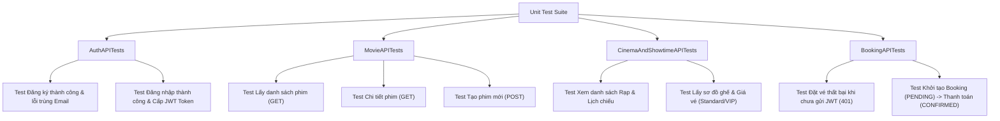

# Báo cáo và Hướng dẫn Viết Unit Test cho RESTful APIs Dự án Movie Ticket

Tài liệu này giải thích chi tiết cấu trúc bộ Unit Test tự động cho các cổng RESTful API trong dự án Movie Ticket, nguyên lý hoạt động của `APITestCase` và kết quả thực thi kiểm thử.

---

## 1. Cấu trúc Bộ Kiểm Thử (Test Suite Overview)

Bộ Unit Test cho API của dự án được tổ chức tại tệp tin [cinema/tests.py](file:///d:/Kaopiz/Python%20Roadmap/movie_project/cinema/tests.py), phân thành 4 nhóm Test Class chuyên biệt:



---

## 2. Chi tiết các Test Case tiêu biểu

### 2.1. Kiểm thử Xác thực Auth & JWT (`AuthAPITests`)
Kiểm tra luồng đăng ký tài khoản mới và luồng đăng nhập cấp token JWT:

```python
def test_register_user_success(self):
    payload = {
        'full_name': 'Nguyen Van A',
        'phone_number': '0912345678',
        'email': 'user_a@example.com',
        'password': 'Password123',
        'confirm_password': 'Password123'
    }
    response = self.client.post(self.register_url, payload, format='json')
    self.assertEqual(response.status_code, status.HTTP_201_CREATED)
    self.assertIn('access', response.data['tokens'])
```

---

### 2.2. Kiểm thử API Phim (`MovieAPITests`)
Kiểm tra khả năng truy vấn danh sách phim và tạo phim mới:

```python
def test_create_movie(self):
    url = reverse('api-movie-list')
    payload = {
        'title': 'Avatar 2',
        'duration': 192,
        'description': 'Sci-fi blockbuster',
        'rating': 7.8
    }
    response = self.client.post(url, payload, format='json')
    self.assertEqual(response.status_code, status.HTTP_201_CREATED)
    self.assertEqual(response.data['title'], 'Avatar 2')
```

---

### 2.3. Kiểm thử Sơ đồ ghế & Giá vé (`CinemaAndShowtimeAPITests`)
Kiểm tra API `/api/showtimes/<id>/seats/` trả về đúng danh sách ghế cùng nhãn giá vé và trạng thái `is_booked`:

```python
def test_get_showtime_seats(self):
    url = reverse('api-showtime-seats', kwargs={'showtime_id': self.showtime.id})
    response = self.client.get(url)
    self.assertEqual(response.status_code, status.HTTP_200_OK)
    self.assertIn('seats', response.data)
```

---

### 2.4. Kiểm thử Luồng Đặt vé & Thanh toán JWT (`BookingAPITests`)
Sử dụng `self.client.force_authenticate(user=self.user)` để mô phỏng Client đính kèm JWT Access Token:

```python
def test_create_and_pay_booking_success(self):
    # 1. Giả lập đăng nhập JWT Token
    self.client.force_authenticate(user=self.user)
    
    # 2. Tạo đơn đặt vé PENDING
    booking_url = reverse('api-booking-list')
    payload = {'showtime_id': self.showtime.id, 'selected_seat_ids': [self.seat_1.id]}
    response = self.client.post(booking_url, payload, format='json')
    self.assertEqual(response.status_code, status.HTTP_201_CREATED)
    booking_id = response.data['id']

    # 3. Xác nhận thanh toán -> Chuyển sang CONFIRMED
    pay_url = reverse('api-booking-pay', kwargs={'booking_id': booking_id})
    pay_response = self.client.post(pay_url)
    self.assertEqual(pay_response.status_code, status.HTTP_200_OK)
    self.assertEqual(pay_response.data['booking']['status'], 'CONFIRMED')
```

---

## 3. Kết quả Chạy Kiểm Thử (Execution Result)

Khi thực thi lệnh:
```bash
python manage.py test cinema
```

**Kết quả đầu ra (Output):**
```text
Found 11 test(s).
Creating test database for alias 'default'...
System check identified no issues (0 silenced).
...........
----------------------------------------------------------------------
Ran 11 tests in 1.539s

OK
Destroying test database for alias 'default'...
```
$\Rightarrow$ Tất cả **11/11 test cases** đều chạy thành công xuất sắc (OK) trong vòng 1.5 giây.
