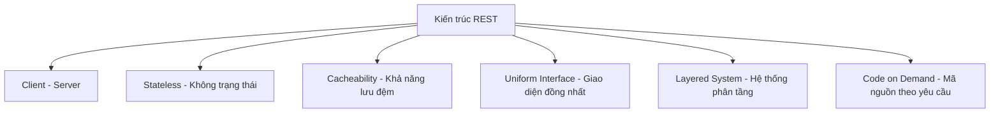

# Báo cáo tìm hiểu về RESTful API và các Phương thức HTTP (HTTP Methods)

Tài liệu này cung cấp cái nhìn tổng quan toàn diện và chi tiết về các khái niệm cốt lõi của kiến trúc RESTful API, các phương thức truyền tải dữ liệu qua giao thức HTTP, cùng các quy chuẩn thiết kế API chuẩn công nghiệp.

---

## 1. RESTful API là gì?

**REST (Representational State Transfer)** là một phong cách kiến trúc phần mềm được Roy Fielding đề xuất vào năm 2000 trong luận án tiến sĩ của mình. REST không phải là một tiêu chuẩn hay giao thức bắt buộc, mà là một **tập hợp các ràng buộc thiết kế** nhằm xây dựng các hệ thống phân tán hiệu năng cao trên môi trường Web.

Một API tuân thủ đầy đủ các nguyên tắc ràng buộc của REST được gọi là **RESTful API**.

---

## 2. Các ràng buộc kiến trúc cốt lõi của REST

Để một hệ thống được công nhận là chuẩn REST, hệ thống đó phải tuân thủ 6 ràng buộc (constraints) sau:

### 1. Client - Server (Khách - Chủ)
Tách biệt rõ ràng trách nhiệm giữa giao diện người dùng (Client) và logic xử lý/lưu trữ dữ liệu (Server). Client không cần quan tâm đến cách Server lưu dữ liệu, và Server không cần quan tâm đến cách Client hiển thị giao diện. Sự tách biệt này giúp cả hai thành phần có thể phát triển độc lập.

### 2. Statelessness (Không trạng thái)
Server **không lưu trữ** bất kỳ thông tin ngữ cảnh (session) nào của Client giữa các request. Mỗi request từ Client gửi lên Server phải chứa đầy đủ tất cả các thông tin cần thiết để Server có thể hiểu và xử lý request đó độc lập.

### 3. Cacheability (Khả năng lưu bộ nhớ đệm)
Dữ liệu phản hồi từ Server (Response) phải tự định nghĩa xem nó có được phép lưu cache hay không. Nếu dữ liệu được phép cache, Client hoặc các trạm trung gian (CDN, Proxy) có thể tái sử dụng dữ liệu này cho các request tương tự tiếp theo, giúp giảm tải cho Server và tăng tốc độ phản hồi.

### 4. Uniform Interface (Giao diện đồng nhất)
Đây là ràng buộc quan trọng nhất định hình nên REST. Giao diện giữa Client và Server phải đồng nhất thông qua:
- **Xác định tài nguyên (Identification of resources)**: Tài nguyên được định danh duy nhất qua các URI (Uniform Resource Identifier).
- **Thao tác tài nguyên qua các đại diện (Manipulation of resources through representations)**: Khi Client nắm giữ đại diện của một tài nguyên (ví dụ: chuỗi JSON), họ có đủ thông tin để chỉnh sửa hoặc xóa tài nguyên đó trên Server.
- **Thông điệp tự mô tả (Self-descriptive messages)**: Mỗi thông điệp phải chứa đủ thông tin để chỉ ra cách xử lý nó (ví dụ: `Content-Type: application/json`).
- **HATEOAS (Hypermedia As The Engine Of Application State)**: Server trả về dữ liệu kèm theo các liên kết (links) để hướng dẫn Client các thao tác tiếp theo có thể thực hiện đối với tài nguyên đó.

### 5. Layered System (Hệ thống phân tầng)
Client thường không thể biết được mình đang kết nối trực tiếp với Server cuối cùng hay thông qua các lớp trung gian (như Load Balancer, API Gateway, Firewall). Ràng buộc này giúp tăng tính bảo mật và khả năng mở rộng quy mô hệ thống.

### 6. Code on Demand (Mã nguồn theo yêu cầu - Tùy chọn)
Server có thể mở rộng tạm thời chức năng của Client bằng cách truyền tải các đoạn mã thực thi được (như mã JavaScript hoặc các Java Applet). Đây là ràng buộc tùy chọn duy nhất của REST.

---

## 3. Tài nguyên (Resources) và Thiết kế URI

Trong REST, mọi thứ đều được xem là **Tài nguyên** (Ví dụ: một bộ phim, một người dùng, một rạp chiếu).

### Nguyên tắc đặt tên URI:
1. **Sử dụng Danh từ thay vì Động từ**:
   - 🔴 *Sai*: `GET /getMovies/` hoặc `POST /createNewMovie/`
   - 🟢 *Đúng*: `GET /movies/` hoặc `POST /movies/`
2. **Sử dụng Danh từ số nhiều cho các tập hợp (Collections)**:
   - `GET /movies/` (Lấy danh sách các bộ phim).
   - `GET /movies/12/` (Lấy thông tin bộ phim cụ thể có ID là 12).
3. **Thể hiện mối quan hệ phân cấp qua đường dẫn**:
   - `GET /cinemas/3/rooms/` (Lấy danh sách phòng chiếu thuộc rạp chiếu có ID là 3).

---

## 4. Các phương thức HTTP (HTTP Methods)

REST sử dụng trực tiếp các phương thức tiêu chuẩn của giao thức HTTP để thực hiện các thao tác CRUD (Create, Read, Update, Delete) trên tài nguyên:

| Phương thức | Thao tác CRUD | Mô tả hành vi | Safe (An toàn)? | Idempotent (Đồng nhất)? |
| :--- | :--- | :--- | :--- | :--- |
| **GET** | **Read** | Lấy thông tin đại diện của một tài nguyên hoặc một tập hợp tài nguyên từ Server. | **Có** | **Có** |
| **POST** | **Create** | Gửi dữ liệu lên Server để tạo mới một tài nguyên. | **Không** | **Không** |
| **PUT** | **Update** | Thay thế hoàn toàn tài nguyên hiện tại bằng dữ liệu mới gửi lên. Nếu tài nguyên chưa tồn tại, có thể tạo mới (tùy thiết kế). | **Không** | **Có** |
| **PATCH** | **Update** | Cập nhật một phần (chỉ thay đổi một vài trường cụ thể) của tài nguyên hiện có. | **Không** | **Không** |
| **DELETE** | **Delete** | Yêu cầu Server xóa bỏ tài nguyên được chỉ định. | **Không** | **Có** |

### Giải thích các khái niệm quan trọng:
* **Safe Methods (Phương thức an toàn)**: Là các phương thức **không làm thay đổi trạng thái** cơ sở dữ liệu trên Server (chỉ đọc dữ liệu). Ví dụ: `GET`, `HEAD`, `OPTIONS`.
* **Idempotent Methods (Phương thức đồng nhất / Bất biến)**: Là các phương thức mà khi Client gọi thực thi **một lần hay nhiều lần liên tiếp** với cùng một tham số, kết quả trạng thái cuối cùng trên Server vẫn **không thay đổi** so với lần gọi đầu tiên.
  - *Ví dụ về PUT (Idempotent)*: Nếu bạn gửi yêu cầu cập nhật tuổi của User là 30 (`PUT /users/1 {"age": 30}`), dù bạn có gọi lệnh này 100 lần thì tuổi của User đó vẫn luôn là 30.
  - *Ví dụ về POST (Non-idempotent)*: Nếu bạn gửi yêu cầu tạo hóa đơn (`POST /bookings/`), mỗi lần bạn gọi lệnh này, Server sẽ tạo ra một bản ghi hóa đơn mới trong database $\rightarrow$ Trạng thái Server thay đổi sau mỗi lần gọi.

---

## 5. Mã phản hồi HTTP (HTTP Status Codes)

RESTful API sử dụng các mã trạng thái HTTP tiêu chuẩn để thông báo kết quả xử lý yêu cầu về cho Client:

* **2xx: Thành công (Success)**
  - `200 OK`: Yêu cầu xử lý thành công (thường dùng cho GET, PUT, PATCH).
  - `201 Created`: Tạo mới tài nguyên thành công (thường dùng cho POST).
  - `204 No Content`: Xử lý thành công nhưng không có dữ liệu trả về (thường dùng cho DELETE).
* **3xx: Chuyển hướng (Redirection)**
  - `304 Not Modified`: Tài nguyên chưa bị thay đổi, Client có thể sử dụng dữ liệu trong bộ nhớ đệm (Cache).
* **4xx: Lỗi phía Client (Client Errors)**
  - `400 Bad Request`: Dữ liệu gửi lên không đúng định dạng hoặc thiếu các trường bắt buộc.
  - `401 Unauthorized`: Client chưa đăng nhập hoặc token xác thực không hợp lệ.
  - `403 Forbidden`: Client đã đăng nhập nhưng không có quyền truy cập tài nguyên này (ví dụ: user thường cố truy cập link admin).
  - `404 Not Found`: Không tìm thấy tài nguyên tương ứng với URI.
  - `405 Method Not Allowed`: Phương thức HTTP không được hỗ trợ đối với tài nguyên này (ví dụ: cố tình `POST` vào link chỉ cho `GET`).
* **5xx: Lỗi phía Server (Server Errors)**
  - `500 Internal Server Error`: Server gặp lỗi logic hệ thống hoặc crash mã nguồn không mong muốn.
  - `502 Bad Gateway / 503 Service Unavailable`: Server trung gian không kết nối được hoặc Server chính đang quá tải, bảo trì.
