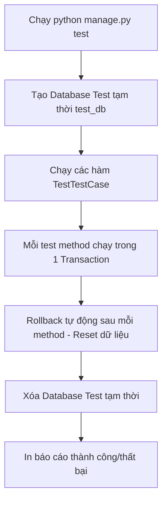

# Hướng dẫn Tìm hiểu và Viết Unit Test trong Python Django

Tài liệu này cung cấp cái nhìn toàn diện về **Unit Test (Kiểm thử đơn vị)** trong framework Django: từ lý thuyết nền tảng, cấu trúc test runner, cách viết test cho Model / View / REST API, đến cách đo lường độ bao phủ mã nguồn (Code Coverage).

---

## 1. Unit Test trong Django là gì và Tại sao cần thiết?

**Unit Test (Kiểm thử đơn vị)** là quá trình tự động hóa việc kiểm tra các thành phần nhỏ nhất của phần mềm (như một hàm, một model method, một API endpoint) để đảm bảo chúng hoạt động đúng như thiết kế.

### Lý do phải viết Unit Test:
1. **Phát hiện lỗi sớm (Prevent Regressions)**: Khi bạn sửa code hoặc nâng cấp thư viện, Unit Test giúp bạn biết ngay liệu tính năng cũ có bị hỏng hay không.
2. **Tiết kiệm thời gian thử nghiệm**: Thay vì phải bật trình duyệt, đăng nhập, click từng nút để test luồng đặt vé, chạy 1 dòng lệnh test chỉ mất **vài giây**.
3. **Cơ sở cho CI/CD**: Giúp tự động hóa quá trình kiểm tra trước khi merge code hoặc deploy lên máy chủ sản phẩm.

---

## 2. Cơ chế làm việc của Django Test Framework

Django tích hợp sẵn bộ kiểm thử dựa trên thư viện chuẩn `unittest` của Python, kết hợp với các công cụ tối ưu cho cơ sở dữ liệu và HTTP client:



### Đặc điểm quan trọng:
* **`django.test.TestCase`**: Lớp base mặc định. Mỗi test method sẽ được bao bọc trong một **Database Transaction** và được rollback sạch sẽ sau khi thực thi, đảm bảo các test độc lập tuyệt đối với nhau.
* **`setUpTestData(cls)`**: Hàm được gọi **một lần duy nhất** cho toàn bộ class test để chuẩn bị dữ liệu đọc chung, giúp tăng tốc độ chạy test đáng kể so với `setUp()`.

---

## 3. Các loại Unit Test phổ biến trong Django

### 3.1. Model Testing (Kiểm thử Model & Logic nghiệp vụ)
Kiểm tra các phương thức tùy chỉnh (`custom methods`), thuộc tính tính toán, validation và hàm `__str__()`.

```python
# cinema/tests/test_models.py
from django.test import TestCase
from decimal import Decimal
from cinema.models import Movie, Cinema, Room, Showtime

class MovieModelTest(TestCase):
    @classmethod
    def setUpTestData(cls):
        # Tạo dữ liệu chung dùng cho tất cả test cases trong class này
        cls.movie = Movie.objects.create(
            title="Inception",
            duration=148,
            rating=Decimal('8.8')
        )

    def test_movie_str_representation(self):
        """Kiểm tra hàm __str__ trả về đúng tên phim"""
        self.assertEqual(str(self.movie), "Inception")

    def test_movie_duration_positive(self):
        """Kiểm tra thời lượng phim phải là số dương"""
        self.assertGreater(self.movie.duration, 0)
```

---

### 3.2. View & Template Testing (Kiểm thử Giao diện Web)
Kiểm tra phản hồi HTTP (Status 200, 302, 404), template được sử dụng, và context dữ liệu truyền ra màn hình bằng `self.client`.

```python
# cinema/tests/test_views.py
from django.test import TestCase
from django.urls import reverse
from django.contrib.auth.models import User

class MovieViewTest(TestCase):
    def test_home_page_status_code(self):
        """Kiểm tra trang chủ trả về HTTP 200 OK"""
        response = self.client.get(reverse('home'))
        self.assertEqual(response.status_code, 200)
        self.assertTemplateUsed(response, 'home.html')

    def test_protected_page_redirects_anonymous_user(self):
        """Kiểm tra trang yêu cầu đăng nhập sẽ chuyển hướng người dùng chưa đăng nhập"""
        response = self.client.get(reverse('my-bookings'))
        self.assertEqual(response.status_code, 302) # Redirect sang trang login
```

---

### 3.3. RESTful API Testing (Kiểm thử APIEndpoints)
Sử dụng `APITestCase` từ Django Rest Framework (DRF) để test các phương thức GET, POST, PUT, DELETE và xác thực token JWT.

```python
# cinema/tests/test_api.py
from rest_framework.test import APITestCase
from rest_framework import status
from django.urls import reverse
from django.contrib.auth.models import User

class MovieAPITest(APITestCase):
    def test_get_movie_list_api(self):
        """Kiểm tra API lấy danh sách phim thành công"""
        url = reverse('api-movie-list')
        response = self.client.get(url)
        self.assertEqual(response.status_code, status.HTTP_200_OK)
        self.assertIn('movies', response.data)

    def test_booking_api_requires_authentication(self):
        """Kiểm tra API đặt vé báo lỗi 401 khi chưa gửi JWT token"""
        url = reverse('api-booking-list')
        response = self.client.get(url)
        self.assertEqual(response.status_code, status.HTTP_401_UNAUTHORIZED)
```

---

## 4. Hướng dẫn Chạy Test và Đo lường độ bao phủ (Coverage)

### 4.1. Lệnh chạy Test cơ bản trong Django
Chạy toàn bộ các test trong dự án:
```bash
python manage.py test
```

Chạy test cho riêng ứng dụng `cinema`:
```bash
python manage.py test cinema
```

Chạy một file test cụ thể:
```bash
python manage.py test cinema.tests.test_models
```

---

### 4.2. Đo độ bao phủ mã nguồn bằng `coverage.py`
Để biết ứng dụng của bạn đã được viết test bao nhiêu % dòng code:

1. **Cài đặt thư viện `coverage`**:
   ```bash
   pip install coverage
   ```

2. **Chạy test qua Coverage**:
   ```bash
   coverage run manage.py test
   ```

3. **Xem báo cáo tóm tắt trên Terminal**:
   ```bash
   coverage report
   ```

4. **Xuất báo cáo dạng trang Web HTML trực quan**:
   ```bash
   coverage html
   ```
   *Lệnh này sẽ tạo thư mục `htmlcov/`. Mở file `htmlcov/index.html` trên trình duyệt để xem chi tiết những dòng code nào chưa được test.*

---

## 5. Các nguyên tắc vàng khi viết Unit Test trong Django (Best Practices)

1. **Độc lập (Independent)**: Các test case không được phụ thuộc vào thứ tự chạy của nhau. Một test case bị hỏng không được làm ảnh hưởng đến các test case khác.
2. **Quy tắc đặt tên rõ ràng**: Đặt tên phương thức bắt đầu bằng `test_` và mô tả rõ mục đích (Ví dụ: `test_create_booking_with_invalid_seat_should_fail`).
3. **Không test các thành phần mặc định của Django**: Đừng viết test kiểm tra xem Django ORM có lưu dữ liệu hay không. Hãy tập trung test **Logic nghiệp vụ tùy chỉnh** mà bạn tự viết!
4. **Sử dụng `setUpTestData` cho dữ liệu đọc**: Đặt dữ liệu tĩnh dùng chung trong `setUpTestData` thay vì `setUp` để tăng tốc độ chạy test lên gấp nhiều lần.
